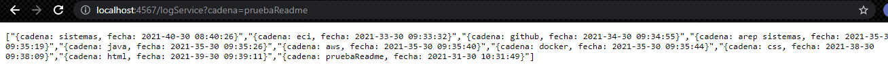

# TALLER DE DE MODULARIZACIÓN CON VIRTUALIZACIÓN E INTRODUCCIÓN A DOCKER Y A AWS
### Daniel Santiago Ducuara Ardila
### 30/09/2021

## EJERCICIO 1
Para la tarea usted debe construir una aplicación con la arquitectura propuesta y desplegarla en AWS usando EC2 y Docker.
El servicio MongoDB es una instancia de MongoDB corriendo en un container de docker en una máquina virtual de EC2
LogService es un servicio REST que recibe una cadena, la almacena en la base de datos y responde en un objeto JSON con las 10 ultimas cadenas almacenadas en la base de datos y la fecha en que fueron almacenadas.
La aplicación web APP-LB-RoundRobin está compuesta por un cliente web y al menos un servicio REST. El cliente web tiene un campo 
y un botón y cada vez que el usuario envía un mensaje, este se lo envía al servicio REST y actualiza la pantalla con la información 
que este le regresa en formato JSON. El servicio REST recibe la cadena e implementa un algoritmo de balanceo de cargas de Round Robin, 
delegando el procesamiento del mensaje y el retorno de la respuesta a cada una de las tres instancias del servicio LogService.

Para ejecutar el programa localmente por consola utilizar:

java -cp "target/classes;target/dependency/*" edu.escuelaing.arep.sparkwebDocker.SparkWebServer

Luego colocar en el navegador:

http://localhost:4567

## Diagrama de clases
 
La clase sparkWebServer contiene un objeto ConnectMongodb y al entrar a /logService se registra la cadena enviada por el usuario, se llama al 
método addString, posteriormente se le retorna al usuario un objeto json con las últimos 10 cadenas registradas, la clase contiene los 
métodos addString y getStringDB que retorna las cadenas almacenadas, para conectar a la base de datos en mongodb se utiliza MongoClient,
MongoDatabase y MongoCollection.

## Funcionamiento
En la siguiente imagen se muestra el inicio y el espacio para que el usuario escriba la cadena.
 
Al registrar la cadena se lleva al usuario a la siguiente página en la que se muestra el json con los últimos 10 datos almacenados,
incluyendo el que acabó de registrar.
 

## Despliegue en AWS
 
 

